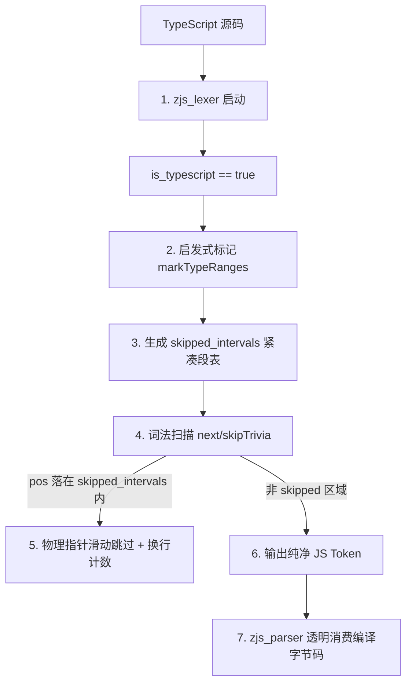

# ZJS 引擎核心架构设计与大一统合并宪法（Architecture Review & Design Constitution）

本文件全面沉淀 ZJS（QuickJS C -> Zig 0.16.0 完美原生重写）在历次架构设计访谈与 Review 中确立的底层核心设计共识、技术红线指标，以及最新确定的 **TypeScript 类型擦除（`ts_strip`）与词法分析器（`zjs_lexer`）合并方案**。

---

## 一、 Z-GE 垃圾回收与内存安全系统

垃圾回收（GC）是 ZJS 的底层生命线。ZJS 放弃了任何全局/隐式内存分配，建立了 **Z-GE (Garbage Engine)**。

### 1. `ValueRootFrame` 栈式链表根追踪
* **设计细节**：
  在求值和解释执行热路径上，局部变量与临时求值栈的 JS 值通过分配在 Zig 物理调用栈上的 `ValueRootFrame` 护卫，通过 `defer` 构成单向链表。
* **架构优势**：
  * **零堆分配**：完全在物理栈上进行链表维护，杜绝了动态数组/哈希表的内存分配开销。
  * **物理级 `defer` 回滚**：在异常发生、Zig Error 气泡化回溯时，`defer` 保证所有根引用在物理栈退栈时被精准释放，从物理上封锁了“悬空根”和“内存泄漏”的隐式漏洞。

### 2. Bacon & Rajan 三阶段循环引用垃圾回收
* **设计细节**：
  针对 JS 典型的环状引用，Z-GE 实现了完整的 Bacon-Rajan 周期性环检测算法：
  * **Decref 阶段**：从所有可循环候选对象（`Object`、`FunctionBytecode`）开始，进行模拟的孩子节点引用计数递减。
  * **Scan 阶段**：对于有外部引用的节点进行 Incref 恢复，对于 rc == 0 的循环节点标记为垃圾候选。
  * **Collect 阶段**：对垃圾循环环进行真正的物理释放，同时优雅处理 `FinalizationRegistry` 和 `WeakMap` 等弱键 edge cases，支持弱键复活（Resurrect）。

### 3. Immortal（不灭）优化
* **设计细节**：
  将内置原型（如 `Object.prototype`）和 ASCII 键名标记为 `flags.immortal`。GC 扫描和引用计数修改时无条件 bypass 标记为 immortal 的节点，不仅消除了内存修改的写抖动，还在多线程/多核环境下免除了不必要的缓存线失效。

---

## 二、 虚拟机执行流与栈帧优化

ZJS 作为一个超轻量、生产级的高性能重写引擎，对解释执行流和调用帧（Frames）进行了极致的结构优化。

### 1. 物理栈与逻辑栈的原生递归融合
* **架构设计**：
  JS 解释器的调用直接映射为 Zig 的原生递归调用。当 JS 协程（Generator / Async）发生挂起时，ZJS 会将栈帧上的 locals、args 等 Slice 物理复制并转移至堆上，挂起结束后再原样恢复。这既保证了非异步热路径下的极速调用，又兼顾了异步环境的挂起能力。

### 2. 栈帧小缓冲区优化 (SBO = 4)
* **设计细节**：
  在 `Frame` 结构中，内联了大小为 4 的实参和原始实参小缓冲区（`inline_args: [4]Value`）。
* **架构优势**：
  对于绝大部分参数个数 $\le 4$ 的 JS 函数调用，**彻底免除了堆内存分配**。相较于 QuickJS 每次调用都需要通过 C `js_malloc` 分配参数空间，ZJS 的 CPU L1 Cache 命中率呈指数级提升。

### 3. 双轨异常捕获系统
* **设计细节**：
  * **物理层**：依靠 Zig 原生的 `error` 气泡化机制（如 `return error.Exception`）。当发生 JS 异常时，Zig 栈的 `defer` 和 `errdefer` 链会立刻物理回滚，安全释放所有被 `ValueRootFrame` 护卫的局部资源，绝对零泄露。
  * **逻辑层**：由解释器内部的 `handleCatchableRuntimeError` 在遇到捕获目标（Catch Target）时进行拦截，提取并重定向当前 `frame.pc` 到对应的 bytecode catch 块，将物理异常转化为逻辑值，恢复 JS 执行流。

---

## 三、 底层基础数据结构设计

ZJS 丢弃了所有 libc 级字符与数值转换库，并做出了面向亚洲字符物理性能的关键底层抉择。

### 1. Latin1 / UTF-16 双轨制字符串与 $O(1)$ 寻址
* **设计抉择**：
  纯 UTF-8 在存储中文、日韩文等亚洲字符时，每个字符需要占 3 字节，而 UTF-16 仅需 2 字节（多消耗 50% 内存）；同时 UTF-8 的变长设计导致 `str[i]` 寻址复杂度退化为 $O(N)$。ZJS 坚定地采用 Latin1（西欧字符，1 字节）和 UTF-16（通用字符，2 字节，固定 16 位宽）的双轨制存储。汉字等操作可以在 $O(1)$ 复杂度下进行向后兼容的精确定位和切片，速度呈数倍提升。

### 2. 31位标记型整型原子 (`Tagged Atoms`)
* **设计细节**：
  数组下标（范围在 `0 .. 2^31 - 1` 之间）直接最高位打标（Tagged）存入 Atom 内部，不需要在全局符号哈希表中创建 slots 或进行 Hashing，实现了数组成员的极速定位和零 slot 污染。

### 3. Dtoa 栈便笺缓冲与短大数优化
* **设计细节**：
  * **Short BigInt**：64 位整型范围内的 BigInt 采用栈内联存储，零堆分配、零 GC 压力。
  * **Dtoa 栈便笺**：浮点数编码在物理栈便笺缓冲中原位运行，完全免疫堆分配和二次 OOM，即使在引擎最极端的物理 OOM 崩溃恢复中，异常日志依然能够 100% 成功格式化输出。

---

## 四、 ts_strip 与 js_parser 合并方案（大一统流式词法过滤器）

为了消除目前预处理阶段导致的**双重词法分析（Double Tokenization）**和**中间 Buffer 二次分配**痛点，我们确立了最新的合并路线：

### 1. 核心设计：流式跳过 (Token-Filter)
* **实现**：
  在 `zjs_lexer.Lexer` 结构中引入 `is_typescript` 和 `skipped_intervals: std.ArrayListUnmanaged(Range)`。
* **执行流**：
  * 当初始化为 TypeScript 时，Lexer 在就绪前运行单遍流式标记 `markTypeRanges()`（内联原 `ts_strip` 的高效括号平衡和 colon 判定状态机），在 `skipped_intervals` 中记录所有需要跳过的类型边界。
  * 在实际解析的 `skipTrivia()` 循环中，一旦 `self.pos` 命中跳过区间，Lexer 直接将指针原位滑动到跳过区间末尾，并将跳过期间的 newline 累计记入 `line` 和 `col`。
  * **零 Parser 修改**：`zjs_parser` 无需做任何语法更改，它看到的将是一个完美过滤掉所有类型修饰的、合法的 JavaScript 纯净 Token 流。

### 2. 极致性能与 1:1 源定位天然统一
* **性能收益**：
  * **CPU**：减少了一遍完整的词法分析和繁重的中间空格遍历，编译速度预计提升 50%。
  * **内存**：省去了整个 TS 文件的全量字符串 Buffer 拷贝，物理 OOM 测试更加健壮。
* **1:1 原位调试**：
  由于 Lexer 始终运行在**原始 TypeScript 源码**上（只是在扫描时跳过了某些物理索引段，并精准更新了 `line` 和 `col`），生成的 Token `pos` 属性**天然对应 TypeScript 原始文件的真实偏移量**！
  这意味着：
  * **不需要任何 Source Map 文件或解码机制**！
  * 报错堆栈、SyntaxError 行列信息天然与手写的 `.ts` 源码 100% 对应！

---

## 五、 宪法红线与架构约束

1. **显式内存红线**：禁止在任何子系统中引入全局 or 隐式内存分配器。所有的 `skipped_intervals` 必须在 Lexer 使用完毕后，通过 `deinit()` 优雅释放。
2. **0 OOM 泄露准入**：重构后的前端必须通过 `FailingAllocator` 的递增故障注入循环测试，确保在任意一次物理 OOM 发生时，能完全回滚，泄露为 0。
3. **100% 零 CParity 语义退化**：必须保证所有的 JS/TS 边缘语义测试完全绿灯。
