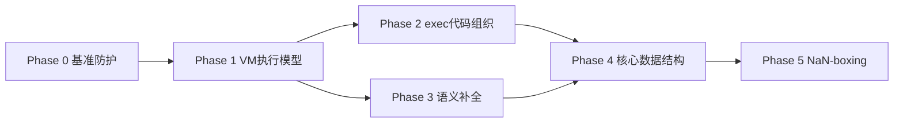

# zjs 架构改进路线图（对齐 QuickJS）

## 背景结论

对比 `../quickjs`（`quickjs.c`/`quickjs.h`）后的核心判断：shape/IC、循环 GC、单遍 parser、async/generator 架构已与 QuickJS 同构甚至领先；**最大差距在执行模型**（递归解释器 vs 单循环连续栈帧），其次是核心数据结构（16B JSValue、Atom/String 分离、FunctionBytecode 碎片化）与代码组织（`shared.zig` 15K 行等）。test262 门禁当前 0 失败，是全程回归底线。

## Phase 0 — 真实基准与测量防护

当前 `reports/perf/baseline/microbench-zjs-releasefast.json` 的 `qjs` 字段指向 zjs 自身（自基准）。改为对照真实 QuickJS：

- 用 `tools/compare/run_microbench.js` 对接 `../quickjs/build/qjs`，建立 call/property/string/arith/closure 五类基线并入库 `reports/perf/baseline/`。
- 确认 `core.OpcodeProfile` 能区分「分发开销 / 调用开销 / 属性开销」，为 Phase 1 提供前后对照。

## Phase 1 — VM 执行模型重构（最大收益，最高风险）

目标：从「每次调用递归进新解释器 + 堆分配操作数栈」改为 QuickJS 式「单循环 + 连续 VM 栈」。涉及 [src/exec/zjs_vm.zig](src/exec/zjs_vm.zig)、[src/exec/frame.zig](src/exec/frame.zig)、[src/exec/stack.zig](src/exec/stack.zig)、[src/exec/shared.zig](src/exec/shared.zig)。

1. **统一 VM 栈**：每 context 一条连续 `JSValue` 栈，帧布局 `[args | locals | operand stack]`（镜像 `JS_CallInternal` 的 `local_buf` 布局），替换 `callFunctionBytecodeModeState` 中每调用 `Stack.init` 堆分配；`FrameRootScope` 改为 root 栈区间。
2. **调用内联**：`op.call`/`call_method` 目标为字节码函数时，在同一循环内 push 帧并 `continue`，不再递归 `runWithArgsState`（native 函数仍走出栈调用）；异常 unwinding 与 `catch_target` 改为按帧记录。
3. **真 TCO**：`op.tail_call` 复用当前帧槽位，随后在 `test262.conf` 启用 `tail-call-optimization` 验证。
4. **零拷贝参数**：callee 的 args 直接指向 caller 栈区，仅 `argc < arg_count` 时补 undefined（镜像 quickjs.c:17631）。
5. **热路径开销治理**：每-opcode 的 profile scope 改为 comptime build option（release 零成本）；`stopBeforePc` 只在 generator resume 外壳生效；backtrace 改为惰性（仅异常物化时解析名字，删除每调用的 `backtraceFunctionNameAtom` 分配）。
6. **参数结构化**：`runWithArgsState` 的 25 个参数收敛为 `CallEnv` 结构体，eval/generator 特例移入帧状态。

风险点：generator 的 `saveGeneratorExecutionState` 需从统一栈拷出/拷回；GC rooting 区间化。每步用全量 test262-gate 验证。

## Phase 2 — exec 代码组织收敛

- 按 [docs/perf/shared-vm-decomposition.md](docs/perf/shared-vm-decomposition.md) 的准则拆 `shared.zig`（15,175 行）：coercion、global ops、closure/var-ref、call runtime、builtin glue，单文件目标 <3K 行；合并与 [src/exec/call.zig](src/exec/call.zig) 的重叠调用逻辑。
- 拆 [src/exec/vm_property.zig](src/exec/vm_property.zig)（13,119 行）：locals / globals / field / array_el / with 子模块。
- 合并 `popCatchMarker` 双实现（`vm_control.zig` 与 `array_ops.zig` 各一份）。
- 处置预留 opcode 246–248（`get_field_data_slot` 等）：实现 emit + dispatch 接通既有 IC（推荐，降低通用 `get_field` 开销），否则从 `opcodeHasOwnDataIc` 移除。
- 删除 legacy [src/bytecode/scope.zig](src/bytecode/scope.zig) 死路径（先验证 parser 确实不再引用）。
- Phase 1 完成后，大量 comptime 回调注入参数会自然消失，顺势精简函数签名。

## Phase 3 — 语义补全（前端管线 + RegExp）

- 补 `add_module_variables` 等价 pass：编译末期把 export 绑定到 closure 索引（对照 quickjs.c:36073）；补 `add_eval_variables` 与 scope 重链步骤；落到 [src/bytecode/pipeline/finalize.zig](src/bytecode/pipeline/finalize.zig)。
- 补全 `VarDef.is_captured` / `var_ref_count` 链路（当前几乎无写入），对齐 QuickJS `capture_var` 驱动 `close_loc` 的模型。
- RegExp v-flag UnicodeSets：修复后收窄 `test262.conf` 中 ~100 条 `unicodeSets/generated/` 排除。
- 实现 `regexp-duplicate-named-groups`（当前 skip，16 个用例）。
- 实现 String rope（`string_rope` tag 已预留无实现，对照 quickjs.c `JSStringRope`），改善长串拼接。

## Phase 4 — 核心数据结构重构（侵入式，测量驱动）

- **Atom/String 合一**：参照 `JSAtomStruct == JSString`，atom 表持有 `*String`（8/16 位数据），消除 UTF-8 双份存储与往返转换；同时加 atom 槽位空闲链复用（当前单调增长）。涉及 [src/core/atom.zig](src/core/atom.zig)、[src/core/string.zig](src/core/string.zig)。
- **FunctionBytecode 紧凑化**：消解偏差 D2，20+ 独立 slice 收敛为单块/少块布局（[src/core/function_bytecode.zig](src/core/function_bytecode.zig)）；编译期 `Bytecode`/`FunctionDef` 双轨收敛为 FunctionDef 中心（QuickJS 模型）。
- **WeakRef 注册表**：`liveObjectFromWeakIdentity` 当前 O(n) 扫 `gc_obj_list`，改为弱引用表 + 对象释放时失效（对照 QuickJS `first_weak_ref` 链）。
- **GC 脚手架处置**：移除默认关闭的 Z-GE nursery/remembered-set/dirty-card 脚手架（git 历史可找回），保留 RC + 循环回收主路径；评估循环回收的 `AutoHashMap` visited 改为 header mark 位。
- **Object 头瘦身与属性元数据去重**：散装 bool 收敛为位域；去掉 shape.props 与 object.properties 双份 `atom_id`/`flags`（shape 持元数据、对象持值，QuickJS 模型）。

## Phase 5 — NaN-boxing（最后，测量门控）

- 先做 JSValue 封装 pass：所有 `payload`/`tag` 直接字段访问收敛到访问器 API（机械改动，行为不变）。
- 参照 quickjs.h `JS_NAN_BOXING` 实现 comptime 可切换的 8 字节表示，作为 build option 双模式跑全门禁；微基准确认收益后再翻转默认值。

## 验证纪律（每阶段）

- 迭代期：定向编译 + 焦点单测 + test262 切片（按 AGENTS.md）。
- 阶段收口：`zig build test --summary all` + `zig build test262-gate` + 微基准对照 `../quickjs/build/qjs`；最终 `ReleaseSafe` 一次。
- 同步更新 [docs/architecture_review.md](docs/architecture_review.md) 与 [docs/stack_bytecode_vm_design.md](docs/stack_bytecode_vm_design.md)（本计划保持 stack bytecode，不做 register VM，与现有设计边界一致）。