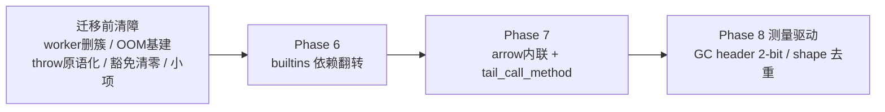

# zjs 架构改进路线图 R5（builtins 翻转轮）

接替已全部完成的 R4 路线图（`zjs_架构改进路线图_cd73a21f.plan.md`，已按
完成惯例移出活动树，git 历史可找回）。本文是
2026-06-13 grill 会话的裁决记录与执行路线；前提事实均已核实并标注出处，
未来会话不应重新推导。

## 0. 方法与共识基线

审视方法：**QuickJS 透镜**——每处偏离参照实现的结构，要么有文档化的成本
评估（维持），要么回归参照形态（修正）。

### 维持原判（本轮复核后不再质疑）

- `zjs_parser.zig` 单体、generator 帧豁免 arena、`Bytecode`/`FunctionBytecode`
  双载体、顶层脚本不物化——architecture_review.md 已有成本评估。
- `runtime/`、`binding/` 位于 exec 之上，import exec 合法（check_deps.js 矩阵）。
- **双 JSValue 表示永久双模式**：QuickJS 以 `#ifdef JS_NAN_BOXING` 永久维护
  双布局，双模式本身就是参照设计；唯一余项是平台理由文档化（pre-small-items）。
- **Atomics 等待机制留 exec**：QuickJS 同样放引擎（quickjs.c:61234
  `js_atomics_wait`）；P6 期间顺势拆出独立 `exec/atomics_wait.zig` 即可。
- GC 三 AutoHashMap→header 2-bit、shape/object 元数据去重：维持「已评估
  待做、测量驱动」，排 Phase 8。
- **fun（../fun）是 zjs 下游**；fun 的需求与其 zjs-redesign 文档不反向影响
  zjs 架构判断（用户裁决：zjs 是基石，必须独立牢固）。

## 1. 决策记录

### D1 builtins/exec 依赖翻转（→ Phase 6）

**现状**：依赖规则禁止 builtins→exec，迫使 ~20K 行内建方法语义流亡
`exec/*_ops.zig`（array_ops 197 pub fn、string_ops 218、object_ops 211），
`builtins/` 退化为安装表+id 枚举；`exec/call.zig:305` 的 comptime
`host_function_records` 表与 `@intFromEnum(builtins.*.StaticMethod.*)` 比对
遍布分发路径——exec 在编译期知道每一个内建方法。

**参照**：QuickJS 中 builtins 是引擎内部 API 的**客户**，不是层——实现与
声明表同地共置（quickjs.c:45236 `js_array_proto_funcs`），函数指针分发
（quickjs.h:1323 `JSCFunctionListEntry`），context init 安装
（`JS_SetPropertyFunctionList`），VM 对具体内建零编译期知识。

**裁决**：翻转为 QuickJS 客户模型。终态验收四条：`HostFunction` 枚举删除；
`exec/*_ops.zig` 仅剩 VM ops；依赖规则反转为 `exec must not import
builtins`；deps-allowlist 清零。

**执行要点**：

- 分发：comptime 物化静态表（内建是编译期闭集，无需 external host 那种
  运行时注册），builtins 侧构建，`JSRuntime` 持表指针，exec 经
  `rt.internal_builtins[id]` 调用；fn 指针类型与 id 命名空间留
  `core/host_function.zig`。`ExternalRecord` 机制（runtime.zig:680）是
  同构先例。一次间接调用与现有 600 分支 jump table 同级。
- 留/迁判据：被 opcode handler / VM 内部直接调用 → **留** exec（VM op）；
  仅经 native 函数对象分发可达 → **迁** builtins。判定按 class 做调用点分析。
- 顺序：Math/JSON 试点 → 叶子 glue（URI 等）→ Boolean/Number/Symbol/
  Date/Error → collections/iterator → String → Object/Array（opcode 纠缠
  最深）→ RegExp 最后（regexp_fastpath 纠缠）。**Promise/generator 核心
  机制留 exec**（QuickJS 把 promise 核心放引擎）。
- 快路径（regexp_fastpath、fast array/string）按 core class-id 键控留
  exec——它们直接操作 core 数据结构，不依赖内建实现代码。
- 安装：root facade（check_deps 已允许 import builtins）或 context-init
  回调编排。
- 提交模式（用户裁决）：全量迁移完成后**单 commit 可接受**；过程中按
  class 本地检查点（focused 单测 + test262 切片 + 微基准），收口跑全门禁。
- 本项为**纯组织收益**（无性能/语义红利），与历轮手术不同，预期基准持平。

### D2 QjsWorker 死簇删除（→ 迁移前，独立 commit）

**证据链（已核实）**：唯一创建入口 `createOsModuleNativeFunction`
（call_runtime.zig:4282，legacy `qjs:os` 残留命名）全树零调用方；
`qjsWorkerFunctionCall` 仅被 call_runtime 内部 3 个字符串分发点
（:525/:644/:1459）调用，传递性死亡；`current_qjs_worker` 恒 null；
test262 agent 是 CLI 层独立实现（run_test262.zig:2500 `Test262Agent` +
external host context），与 QjsWorker 无关。eecf6c8 删 `qjs:std/os` 时
漏删了本体。

**删除范围**：`QjsWorker`/`QjsWorkerCoordinator`/`WorkerMessage`/
`WorkerPostTarget`、postMessage/poll/sleep 实现、3 个字符串分发点、
object_ops.zig:3891-3901 worker parent 簇、4 层 `cleanupWorkersForRuntime`
转发链（call_runtime:4382→zjs_vm:1102→runtime/cleanup:26→runtime/public:9）、
root.zig:682 hasDecl 测试、公共符号快照再生
（`architecture-update-api-snapshot`）。fun 侧 VM.zig:81 的调用在 subtree
同步时删除（清理恒空列表，无行为变化）。

**将来真需要 Worker 的路径**（一段话进 architecture_review.md）：fun 侧经
`ExternalHostCall`/`zjs.host.*` 实现 Worker 本体（QuickJS 把 Worker 放
quickjs-libc 的同款分工）；zjs 侧届时补**值序列化原语**（对象图/循环引用/
typed array/SAB 共享/transfer，对齐 QuickJS `JS_WriteObject`/`JS_ReadObject`
——zjs 当前无等价物；死簇的 WorkerMessage 仅 7 种标量+SAB，无抢救价值）。

### D3 OOM 门禁五件套（基建→迁移前；执行档位=阶段收口或更晚）

**背景**：65e22be 退役旧 exhaustive OOM 测试（O(分配点×全套件) 成本结构，
重构期合理）；eecf6c8 随后完成高质量 OOM 硬化（6 个 flatten `@panic` 收敛
为 1 个 last-resort、~40 簇 fallible `ensureFlat`、OutOfMemory→InternalError、
预分配 OOM error 零分配投递），但验证是一次性手工冒烟；现状全树零注入测试，
预分配投递路径无单测。OOM 变 catchable 后，不变量从「干净地死」升级为
「捕获后引擎保持一致状态继续运行」。

**五件套（全部 Zig 原生工具，用户裁决）**：

1. **静态规则进 architecture-check**：src/ 禁止对 OutOfMemory 用
   `@panic`/`catch unreachable`，allowlist 仅挂唯一 last-resort（带
   exit_milestone 格式）。能静态禁止的不靠测试逼近。
2. **test-oom 重生**：精选微型脚本 corpus（parse、各 opcode 族 eval、一轮
   循环回收、rope concat+flatten、module link、promise job）×
   `std.testing.checkAllAllocationFailures`；成本由设计有界（分钟级），
   不随套件增长——旧 exhaustive 模式不回归。
3. **恢复金丝雀**内置同一 harness：每次注入失败被捕获后，同一 runtime
   重跑 canary 断言引擎仍工作，deinit 查泄漏——「捕获后一致」的唯一测法。
4. **`-Dzjs_oom_coverage`** 构建选项（同 `-Dzjs_enable_opcode_profile`
   模式）：allocator 包装按调用点记账，报告未被注入扫过的分配点，corpus
   完备性可测量、可收敛。
5. **8MB cap 行为 fixture**：repeat/数组增长 → JS catch InternalError →
   进程存活 → 继续 eval 成功；固化 eecf6c8 的手工冒烟。

**档位**：architecture-check（每次，毫秒）；常规 `zig build test` 仅含
预分配投递单测+最小注入用例（亚秒）；`test-oom` **阶段收口或更晚**（与
ReleaseSafe 同节奏，用户裁决）；engine_production_gate 含 cap fixture +
覆盖率报告。迭代循环零增量成本。

**时序**：基建在 P6 之前立起，P6 各 class 检查点与收口即用——600 函数
搬运期的 errdefer 丢失是注入层头号猎物。

### D4 调用形态手术（→ Phase 7，P6 之后）

**事实（已核实）**：`resolveInlineTarget`（inline_calls.zig:48-61）同时
把守内联调用与尾调用帧复用，`fb.is_arrow_function` 直接出局（:56，注释
理由「lexical this/new.target 装箱规则留一处」）——arrow 不只无 TCO，而是
**整体走 native 递归慢路径**，Phase 1 同循环内联对现代 JS 最常见形态不
生效。递归上限不对称：内联路径=逻辑深度（`stack_limit`），递归路径=
`max(16, stack_limit/16384)`（vm_call.zig:1475）——同一递归代码 function/
arrow 写法深度上限差数量级。微基准语料 call/closure 类全用 function 形态
（microbench_cases.js 仅 4 处 `=>`），悬崖在基线隐形。test262 对 method/
arrow 位置深尾递归覆盖为**空**（tco-member-args.js 名不符实，内容是普通
`f(n-1)`），PTC 特性声明（test262.conf:223）依据不足。失败形态安全
（vm_call.zig:79 双深度守卫→RangeError），非段错误。class-constructor
排除规范正确（无 new 调用即 TypeError）；L0 外壳/跨 realm 排除合理
（QuickJS 全递归且不声明 PTC）。

**裁决（用户确认）**：

- arrow 获得内联资格：arrow 无自有 this/new.target 绑定，装箱规则收进
  两路径共享的 frame setup 原语。收益三连：现代代码进快路径、arrow 尾
  调用经 `tailCallReuse` 自动获得 TCO、递归上限对称。
- `tail_call_method` 帧复用：receiver 进 `tailCallReuse` 帧重建（当前
  zjs_vm.zig:822 → `callValueOrBytecode` 递归）。
- LIMITATIONS.md 记录保留排除（L0 外壳、跨 realm、fusion 体）——移入
  迁移前小项，与手术解耦。
- 基准语料补 arrow case（arrow 调用循环 + arrow 尾递归）；method/arrow
  位置 1e5 深递归 runner fixtures（test262 不覆盖，自建）。
- 时序：P6 之后——两者都动 call_runtime.zig，串行避免双重手术冲突。

### D5 throw/stack 原语化（→ 迁移前）

**事实（已核实）**：结构已 QuickJS 同构——`createNamedError`
（vm_exception_ops.zig:13）唯一构造原语，`throw*Message`
（call_runtime.zig:8198+）为「构造→attachStackToErrorValue→throwValue→
Zig error」标准壳。但 5+ 模块绕壳直调原语且 **0 次 stack 附加**：
eval_entry(:46/:71)/module(:760)/module_graph(:211/:318/:332) 的
SyntaxError、promise_ops(:1327) 的 TypeError、disposable_ops(:267)——这些
错误无 `.stack`。QuickJS 在 `JS_ThrowError2` 单咽喉点内 `build_backtrace`，
所有错误有栈。test262 不测 `.stack`（非标准），门禁不可见；fun 这类
runtime 打印 `error.stack` 时暴露。

**修复**：stack 附加收进 `createNamedError` 内部（预分配 OOM 对象零分配
豁免）；`throw*Message` 家族从 call_runtime 迁回 vm_exception_ops 与原语
同居；删便利 re-export（promise_ops.zig:13-14、array_ops 顶部
`createNamedError*` 转发）。

## 2. 迁移前小项明细（pre-small-items）

- architecture_review.md：撤掉幽灵 `src/bytecode/ic.zig`「兼容导入路径」
  表述（实际是 bytecode/root.zig 的 re-export，该文件不存在）。
- LIMITATIONS.md：新增 PTC 条目（已实现形态、保留排除、深递归失败形态=
  提前 RangeError）。
- architecture_review.md：双值表示补一段平台理由（QuickJS `#ifdef` 双布局
  先例；16B 为参考表示与 NaN-boxing 不可用平台的后路）。

## 3. 阶段流程

## 4. 验证纪律

- 迭代期照旧：定向编译 + 焦点单测 + test262 切片（AGENTS.md）。
- 每个 pre 项独立验证独立落地；worker 删簇后跑 architecture-check（API
  快照再生）+ 全量套件一次。
- P6 按 class 本地检查点：该 class focused 单测 + test262 切片 + 微基准
  对照 `../quickjs/build/qjs`；收口：`zig build test`（Debug）+ ReleaseSafe
  一次 + test262-gate + test-altrepr + **test-oom** + architecture-check +
  微基准全套对照基线（预期持平——本项为纯组织收益）。
- P7 收口同上，另加新 arrow 基准 case 与深递归 fixtures。
- P8 每项先跑基准证明收益再实施（GC header 改造按 architecture_review.md
  要求专门会话 + 全门禁节奏）。
