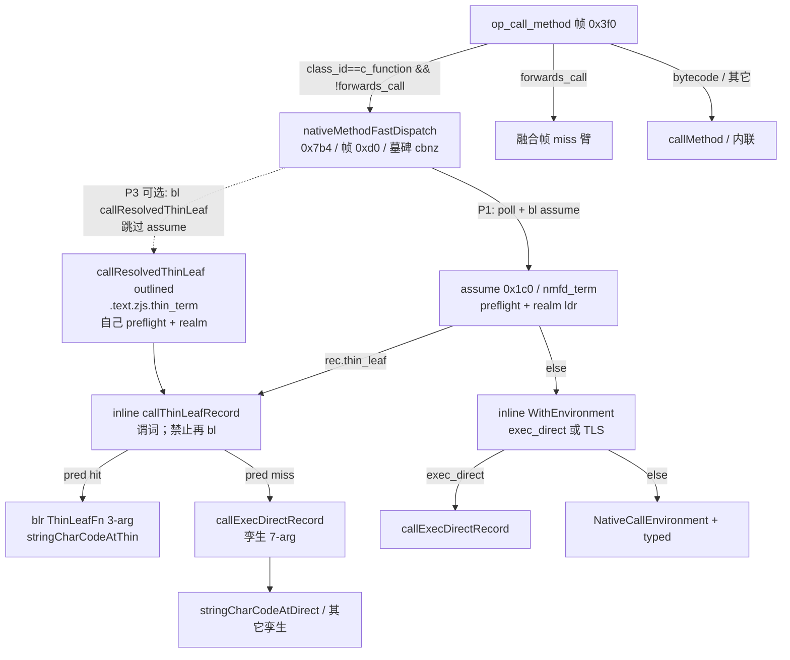

# Native Thin-Tier ABI — 叶 native 瘦协议层

| | |
|---|---|
| 状态 | Draft（rev 2） |
| 作者 | — |
| 日期 | 2026-08-17 |
| 票种 | B-DESIGN（只设计，不落码） |
| 枝 | `grok/pdfjs-native-l` @ `88d35a8d`（L1 冻结） |
| 主干 / RF | `9deb9f45`（w41 L1 已合）；官方 RF = w41 |
| 配置 | `zjs-config-v2:compiler=v2,layout=short,repr=tagged,optimize=ReleaseFast,force_gc=off,ownership_audit=off` |
| 数字 | **非裁决用** |
| 对照 | `/tmp/lanes/PDFJS-RESID.md` / `PDFJS-L.md` / `PDFJS-NATIVE-WALK.md` / `PDFJS-K.md` |

---

## Overview

pdfjs ② 前言在 K/L1 之后仍是最大可砍口（787 vs q 136 = **+651M**，非裁决用）。K3/L1 把热客户（`fromCharCode` / `charCodeAt`）升到 `exec_direct`，吃掉的是 TLS `NativeCallEnvironment` + typed cproto；**壳还在**：NMFD 347 + assume 终端 343 = **690M**。`exec_direct` 的职责已经做完（「不建 env / 不碰 `active_native_call`」）。再升更多 record 到 `exec_direct`（L 族）吃不掉这 690M 壳——`indexOf`/`charAt` 已否。

本案设计一条 **新的瘦 ABI + 独立 dispatch 臂**，只给静态可判的叶 native（无重入 / 无 realm 中途切换 / 无 GC 逃逸）。v1 不升格 `exec_direct`、不灌 assume 回 NMFD、不动墓碑 / `0x3f0` / 岛。

**P1 是协议落地，不是 690M 壳上的刀。** 金丝雀 `charCodeAt` 在 L1 之后已经走 `exec_direct`：TLS / typed / `finalCallEnvironment` class 分叉都已不在 NMFD/assume 热入口上。v1 仍留 `NativeBacktraceScope`，也就是 assume 的 0x1c0 帧。P1 不吃 assume 343M，也不许再加一次 outlined `bl`。壳上的 hop（NMFD 跳过 assume）是 **P3**。P1 能退役的只是叶侧 4 个多余参数、`invokeExecDirectRecord` 的 `callable_realm` 检查 + 7 参 cast、以及抽出的 mid=29 helper（禁止再拼 `NativeCall`）。那一包是否 ≥30M **未知**；P0 dump (2) 出来之前，禁止把 P1 当刀 PR 开。

---

## Background & Motivation

### 现协议（必须对上的代码）

`op_call_method`（帧 **0x3f0**）在 handler 内 resolve + `if (!rec.forwards_call)` 后 `bl nativeMethodFastDispatch`（`src/exec/tailcall_dispatch.zig` ~1768–1780）。NMFD（`src/exec/vm_call.zig:709`，`align(32)`，墓碑 `.space 0x2a8` → 尺寸 **0x7b4**，帧 **0xd0**）再 resolve record、poll、`bl callResolvedNativeMethodAssumeCFunction`（`vm_call.zig:775`，`noinline`，`.text.zjs.nmfd_term`，帧 **0x1c0**，体 **0x334**——源注释 `vm_call.zig:769`）。

assume 经 `callInternalRecordDirectAssumeCFunction`（`builtin_dispatch.zig:380`）做 preflight + `nativeFunctionRealmAssumeCFunction`（`:392`，**不是** `finalCallEnvironment` 的 class 分叉），再进 inline `callInternalRecordDirectWithEnvironment`（`:425`）：

| 臂 | 条件 | 做什么 |
|---|---|---|
| `exec_direct` | `record.exec_direct != null` | inline `callExecDirectRecord`（`:500`）：`NativeBacktraceScope` + `blr` 7 参体。**不**物化 `NativeCallEnvironment`，**不**写 `rt.active_native_call` |
| TLS + typed | 否则 | `NativeBacktraceScope` + 9 字段 env + TLS save/set/restore + `callTypedInternalRecordDirect` cproto `switch` |

今日金丝雀 hop（post-L1 `charCodeAt`）：

`NMFD -bl→ assume [preflight + realm ldr + inline WithEnvironment + inline callExecDirectRecord (sf + blr 7-arg)]`

`ExecDirectCallFn`（`:136`）形状：`(ctx, output, global, this, args, caller_function, caller_frame) HostError!JSValue`。`callResolvedExecDirect`（`:480`）是 **另一条入口**（DINM / 非 assume）：仍做 `preflightCFunctionCall` + `finalCallEnvironment` + `NativeBacktraceScope` + `materializeRuntimeError`。DINM 走这条（`tailcall_dispatch.zig:4769`），**不**走 assume。

construct 路（`callConstructRecordImpl`，`:693`）**永远**全量 env（`is_constructor=true`，`new_target=prototype`）。`internal_builtins.zig:65` 对 construct-capable + `exec_direct` 已经 `@compileError`。

qjs `js_call_c_function` 定义在 quickjs.c:**17562**（首条局部 17563）/ **17575–17590**：建 `JSStackFrame`、栈溢检查（17580）、`ctx = p->u.cfunc.realm`（17586）、argc pad（17592 `unlikely`）、cproto 表 `br`、`blr` 函数指针。**无 TLS。无第二次 outlined hop。**

### 走账（非裁决用）

| 源 | 要点 |
|---|---|
| RESID post-K | ② 787 vs q 136 = **+651M**；NMFD 347 + assume 343 = **690M** 壳；`stringCall` 133→11；typed 123→71 |
| L1 @ `88d35a8d` | `charCodeAt` 升 `exec_direct`；FW −98 / 配对 −193；之后热 native **即使已是 exec_direct 仍付 NMFD+assume** |
| L2 | typed 错误 `cbnz` 仅 4M br — 不立 |
| L3 | NMFD 墓碑 `cbnz` 是几何义务 — **不砍** |
| NATIVE-WALK | n ≈ 25–35M native；qjs 热路径退役跳 ≈ 2 从不采取 + 1 表 `br` |

**关键洞察：** `exec_direct` 已经跳过 env / TLS。已 direct 的叶（`charCodeAt`、`fromCharCode`、`apply`、`hasInstance`）剩余 ② 成本是 **壳**：NMFD（墓碑 + poll + rec resolve + `bl` assume）+ assume（preflight + realm ldr + `NativeBacktraceScope` + `materializeRuntimeError` + `blr`）。再升 `exec_direct` 吃不掉 ~690M 壳。所以 ③ 是 **新层**，不是升格。**吃壳的 hop 是 P3，不是 P1。**

### 现 `exec_direct` 集合（闭集，P0 审计对象）

| record | 文件 | `forwards_call` | 重入？ | v1 thin？ |
|---|---|---|---|---|
| `String.charCodeAt` | `string_builtin_ops.zig:91` `stringCharCodeAtDirect` | false | 热路径否；`:418` `toStringCheckObject` → `toStringForAnnexB`（`string_ops.zig:344`）→ `toPrimitiveForString`（`:387`）→ `callValueOrBytecodeSyncInternalOutlined` **能** | **热路径够格** |
| `String.fromCharCode` | `:69` `stringFromCharCodeDirect` → `qjsStringFromCharCode` | false | 非 int32 走 `toPrimitiveForNumber`（`string_ops.zig:1065`） | **否**（分配新 String + ToPrimitive） |
| `Function.prototype.call` | `function_ops.zig:118` `forwards_call=true` + `exec_direct` | **true** | 转发给用户函数；NMFD 红线 | **否**（`forwards_call`） |
| `Function.prototype.apply` | `:146` `forwards_call=false` + `exec_direct` | false | `qjsFunctionApplyCall`（`call_runtime.zig:1816`）`callValueOrBytecodeSyncInternal` | **否**（重入） |
| `Function[@@hasInstance]` | `:57` `functionHasInstanceDirect` | false | `ordinaryHasInstance`（`:1643`）读 `prototype`，可走 getter / proxy / 用户 `@@hasInstance` | **否** |

`nativeCall()` 恢复 env 的客户（仅 env 路）：array / object / string / json / primitive / atomics / promise / reflect / regexp / math / date / number / iterator / error / function / uri / buffer / collection / builtin_glue / performance。这些全部 **不是** 现 `exec_direct`，更不是 v1 thin。

闭集里 **没有** 第二条 thin-noalloc 候选。P2 不是 P3 的门。

---

## Goals & Non-Goals

**Goals**

- 给「简单 builtin」一条比 `NativeCallEnvironment` + 7 参 `exec_direct` 更瘦的叶 ABI，且 **静态可判**。
- 保全 qjs 对称的异常 / 栈迹（`Error.stack` 上的 native 帧、`CallSite.isNative`）。
- **P1 = 协议落地**（同 hop 数接到 3 参叶 + miss 回孪生）。**P3 = 可选壳 hop**（NMFD 直跳 outlined 终端，跳过 assume）。
- 分段：P0 旗 + 两份 dump → P1 协议 + 金丝雀 →（可选）P2 扩员 → P3 几何短路。每段可独立回滚。
- 验尺钉死几何：NMFD **0x7b4** / 帧 **0xd0** / `align(32)`；`op_call_method` 帧 **0x3f0**；岛 handler 钉死。

**Non-Goals**

- 本票不落码。不改 `src/**`、`test262.conf`、reports、`tools/perf`、git 状态。
- 不 bypass / 不 H3 / 不 OSR / 不 form specials。
- **不** 把 assume 灌回 NMFD（0x1c0→0x1d0 宪）。**不** 把 `NativeCallEnvironment` store 内联进 NMFD。
- **不** 删墓碑。岛外墓碑义务：NMFD 体若再缩必须垫回 **0x7b4**（`.space 0x2a8`）。
- **不** 抬 2048。**不** 动 `call_method` 0x3f0，除非另派。
- **不** 让 `forwards_call` 进 NMFD（`Function.prototype.call` 融合帧红线）。
- **不** 把 `indexOf`/`charAt` 当刀（L 已否；`stringCall` 仅 11M）。
- **不** 升格 `exec_direct` 去跳 sf / realm——那会弄坏 apply / hasInstance。
- **不** 做全程序「此 Zig 函数永不重入」分析器。
- **不** 把 P1 写成 690M / 343M 刀。P1 dump (2) 出来之前不开「刀 PR」。
- **P1 不得** 再 `bl` 第二个 outlined 终端（相对今日多一跳）。

---

## Key Decisions

| # | 裁决 | 理由 |
|---|---|---|
| K1 | **新层，不升格 `exec_direct`** | `exec_direct` 已跳 TLS；剩余 ② 是壳。apply / call / hasInstance 已是 `exec_direct` 但 **不够格** thin。两份契约必须可审计。见 ③。 |
| K2 | v1 资格档 = **thin-noalloc**（不是 thin-alloc-noreenter） | 金丝雀是 `charCodeAt` 热路径。`fromCharCode` 造新 String + ToPrimitive。闭集无第二条候选；放宽另票。见 ①。 |
| K3 | v1 **保留 `NativeBacktraceScope`** | 丢掉 = `Error.stack` / `CallSite.isNative` 语义破。v1 不赌「叶永不抛」。见 ②。 |
| K4 | **显式 comptime 旗** + **指针等于允许名单**，不推断 | 可执行半边是 `entry.thin_leaf == thinLeafFunction(allowlist[i])`。擦除器本身不是门。见 ①。 |
| K5 | P1 **不碰** NMFD 尺寸 / 墓碑 / `0x3f0` | 宪 + K 返工教训。P3 才允许 NMFD 短路，且必须垫墓碑。 |
| K6 | thin record **同时保留 `exec_direct` 孪生**；接线 **只** 在 `callInternalRecordDirectAssumeCFunction` | DINM / `callInternalRecordDirect` / `InRealm` / `call.zig` / `call_runtime.zig` 继续只认 `exec_direct`。禁止把 `thin_leaf` 钩进共享 `WithEnvironment`。 |
| K7 | **一名一职。** P1 = **inline** `callThinLeafRecord`（对位今日 `callExecDirectRecord`）。P3 = **outlined** `callResolvedThinLeaf`（`.text.zjs.thin_term`）。P1 **禁止** `bl` 第二个 outlined 终端 | 今日 hop 已是 `NMFD -bl→ assume [… inline sf + blr]`。P1 再 outlined 是回归。P3 的 outlined 终端是为了让 NMFD 跳过 assume，自己持 preflight+realm+sf。 |
| K8 | `AssumeCFunction` 先看 `thin_leaf`，否则落现 `WithEnvironment` | 同一 record 持两指针。先 thin 金丝雀才走瘦臂。预检 **不** 进 assume（assume 不得长金丝雀形 `if`）。 |
| K9 | **P1 = 协议落地，无 ≥30M 刀门。** 刀门只对「P1-as-knife」或 P3，且必须先有 P0 dump (2) | 调用次数 ≠ 可退役周期。L1 已吃 TLS/typed；v1 留 sf = 0x1c0 帧还在。 |

---

## ① 分层判据

### 谓词（静态、comptime）

一条 record 走瘦层，当且仅当 **同时** 满足：

1. 作者在 `InternalEntry` 上填了 `thin_leaf`（经 `thinLeafFunction(&fn)` 写入）。
2. `denseRecords`（`internal_builtins.zig:46`）comptime **全部通过**（见下 denylist + 允许名单指针相等）。
3. 体是允许名单上的实现。v1 名单 = `[_]ThinLeafFn{&stringCharCodeAtThin}`。不允许「看着像叶就挂上」。

**静态可判：是。** 编码为显式 record 旗 + comptime 拒绝。自动全程序推断「此 Zig 函数永不重入」**不可用**，本案不声称有魔法分析器。旗是证词；denylist + 允许名单相等是可执行半边。

### comptime 拒绝（`denseRecords` 扩现有 construct 门）

现门：`exec_direct != null && isConstructorCProto(cproto)` → `@compileError`（`internal_builtins.zig:65`）。thin 追加：

| 条件 | 原因 |
|---|---|
| `thin_leaf != null && forwards_call` | NMFD 红线。`Function.prototype.call` 必须 miss 融合帧（`tailcall_dispatch.zig:1768`） |
| `thin_leaf != null && isConstructorCProto(cproto)` | construct 永远全量 env（`callConstructRecordImpl` `:720`）。与 `exec_direct` 同禁 |
| `thin_leaf != null && exec_direct == null` | v1 孪生义务：非 assume 调用方 + thin miss 仍走 `exec_direct` |
| `thin_leaf != null` 且对允许名单无一 `entry.thin_leaf == thinLeafFunction(allowed[i])` | **可执行**的闭集门。v1：`const thin_leaf_allowlist = [_]ThinLeafFn{&stringCharCodeAtThin}` |

**不单列**「指针必须是 `ThinLeafFn` / 只能经擦除器写入」——`thin_leaf` 与 `exec_direct` 一样是 `?*const anyopaque`，`thinLeafFunction` 与 `execDirectFunction`（`builtin_dispatch.zig:150`）一样只是 `@ptrCast`。comptime 分不出「擦除器产物」和「手写错 ABI 的 `@ptrCast`」，除非值等于 `thinLeafFunction(允许名单项)`。擦除器仍是唯一 sanctioned 写入方式（好让相等比较成立），但它不是单独的门。

不可在 comptime 机械拒绝、但 **语义拒绝**（作者/评审必须守；Debug/ReleaseSafe 运行时 assert 兜底，见 ⑤）：

- 任何会回调 JS 的路径：用户 `ToString` / `valueOf` / `@@toPrimitive`、getter、proxy trap、`callValue*` / `JS_Call`、job-queue drain（`drainPendingPromiseJobs`）、realm 中途切换 helper、`nativeCall()` TLS 恢复。
- 读 `is_constructor` / `new_target` / `active_native_call`。
- 让 JS 对象以「稍后 finalizer 还需要当前 env/sf」的方式逃逸。
- 同步跑 FinalizationRegistry / WeakRef cleanup / 用户 GC 回调。

### 两档评估与 v1 裁决

| 档 | 含义 | 谁够格 |
|---|---|---|
| **thin-noalloc** | 叶体不分配新的用户可见 JS **对象**（不走 `collectBeforeObjectAllocation`，`runtime.zig:2700`），且不调用户 JS | `charCodeAt` 热路径（已是 string + 立即数下标 → `int32`/`NaN`） |
| **thin-alloc-noreenter** | 可分配，但返回前不得跑用户 JS（含 FR job） | `fromCharCode` 的 int32 快路（造 String）；rope `flatten`（`string.zig:148`） |

**v1 选 thin-noalloc。** 理由：

1. 金丝雀是 `charCodeAt`。L1 后它已是 `exec_direct`，pdfjs 热，体返回数字。
2. `fromCharCode` 的 `qjsStringFromCharCode`（`string_ops.zig:1033`）在非 int32 上走 `toPrimitiveForNumber`——**能重入**。即使 int32 快路只 `String.createAscii`/`createUtf16`，也把证词面扩到 OOM / `singleByteString` / `recentTwoUnitString`。放宽到 thin-alloc-noreenter 是 **另票**，不是本设计的 P2 默认员。
3. 生产配置 `force_gc=off`：`allocStringAlignedBytes`（`runtime.zig:1360`）**不**在每次字符串分配上跑 GC（`runtime_allocation_requests_gc` 仅 test / `force_gc`）。GC 的对象边界是 `collectBeforeObjectAllocation`。FR job 只在 GC sweep 入队（`object.zig:8609` `enqueueFinalizationCleanup`），只在 `drainPendingPromiseJobs` → `drainOnePendingJob` `.finalization`（`promise_ops.zig:4725`）执行。NMFD / assume / `js_call_c_function` **都不 drain job**——这是 qjs 对称，不是 thin 独有的「安全网」。v1 仍然用 noalloc 收紧证词，避免把这条对称当许可证。

**rope flatten 例外（记在档内，不升档）：** 抽出的 mid=29 臂在 rope 上调 `node.flatten()`（与今日 `stringPrimitiveIndexRead` `:246` 同）。`flatten` 经 `String.createUninitialized` → `allocStringAlignedBytes` 造扁 String，缓存进 rope 节点。生产不在此跑 GC；qjs `js_string_charCodeAt` 同样在 `JS_ToStringCheckObject` 里 `js_linearize_string_rope`。v1 **允许** 热路径上的 engine-internal flatten，**不允许** 叶返回一个调用方新持有的 String。第一次线性化之后后续 `charCodeAt` 是真 noalloc。

`force_gc=on` 下 `requestGCForAllocation`（`runtime.zig:2676–2684`）同步 `forceGC` → `pollGC`（一次 major，不是只排队）。flatten 在该配置下 **可以在 thin 帧内入队** FR；job 仍要等 `runJobs` 才跑。P1 FR 夹具必须跑 force-gc / test 配置，不能只在生产路径上「证明无入队」就收工。

### 热 / 冷切（金丝雀必须切开）

`stringCharCodeAtDirect`（`:390`）**整函数不够格**：`:418` `toStringCheckObject` → `toStringForAnnexB` → `toPrimitiveForString` → `callValueOrBytecodeSyncInternalOutlined` 是用户重入。

**唯一机制（P1 起就钉死，禁止其它写法）：**

- **预检住在 `callThinLeafRecord`（P1 inline 终端 / P3 也调用它），不住 assume。** assume / `AssumeCFunction` 只做 `if (record.thin_leaf) |p| return callThinLeafRecord(...)`。禁止在 assume 里写 `isString` / `stringPrimitiveInt32Sat`——那是金丝雀形 `if`，P2 每条叶都会再长一条。
- **终端保持宽参数集**（`output` / `global` / `caller_function` / `caller_frame` + `exec_direct` 孪生指针），**只**为 miss 时 `blr` / 调用 `callExecDirectRecord`。叶仍是 3 参，**无 null 路径**。
- **精确谓词**（P1 写死在 `callThinLeafRecord`，金丝雀专用；下一条叶换谓词仍只活在自己的终端，或将来 `thin_pred`——v1 不引入第二套谓词指针）：

```
this_value.isString()
    and (args.len == 0 or stringPrimitiveInt32Sat(args[0]) != null)
```

`stringPrimitiveInt32Sat`（`string_builtin_ops.zig:285`）命中：int32 / bool / null / undefined / number（含 NaN→0）。返回 `null` 的：string 下标、object、Symbol、BigInt。

- `new String(...)` 与一切非 string 原语（number / bool / null / undefined / symbol / bigint 当 **this**）都是 `!this.isString()` → **miss**。
- miss → `callExecDirectRecord`（孪生 `stringCharCodeAtDirect`，含 ToString 回落）。**不**把 miss 编码成 `error.TypeError`。**不用** `.?`。
- hit → `NativeBacktraceScope` + `blr stringCharCodeAtThin`。叶假定谓词已成立，直接跑抽出的 mid=29 臂。

### 明确排除（即使将来有人想挂旗）

| 排除 | 为什么 |
|---|---|
| `forwards_call` | 融合帧。编译期拒 |
| construct-capable cproto | 已禁 `exec_direct`；construct 读 env |
| `Function.apply` | 重入用户函数 |
| `Function.call` | `forwards_call` |
| `hasInstance` | prototype 链 + 可能的用户 `@@hasInstance` / getter |
| `JSON.parse`/`stringify` reviver/replacer | 用户回调 |
| Array 带 callback 的方法 | 用户回调 |
| Promise / Proxy trap / 用户 `RegExp.exec` | 重入 |
| 读 `nativeCall()` 的一切 | 瘦层没有 env |
| `indexOf` / `charAt` 当刀 | L 已否；不是本层的立刀理由 |

Math `.f_f`（`math_ops.zig:101`）/ `.f_f_f`（`:113`）原语数字臂本身不重入，但 `fallback_function = &mathOpCall` 会 ToPrimitive。它们今天走 typed，**不是** `exec_direct`。要把其中一条收进 thin，必须先有一张「拆 `exec_direct` 孪生」的 **先票**——不是本设计的 P2 员，也不是「再挂 `thin_leaf`」。v1 不收。

### 地址空间（必须限幅，不吹 651M）

thin 只能吃 **够格调用** 上、且 v1 **仍付** sf+preflight+realm 之后剩下来的那一截。L1 后 690M 是 **所有** native 付的壳。

现有走账 **没有** post-L1 按 callee 拆的 NMFD 普查，也 **没有** assume 在 `exec_direct` 臂上按指令归因：

- L.md：n ≈ 30M；升 `exec_direct` **之前** assume 约半/半（charCodeAt TLS vs 已 direct）。那半是 TLS 客户，不是「永远一半调用是 charCodeAt」。
- L1 之后 charCodeAt 仍付 NMFD+assume（只是不再付 TLS/typed）。它在 690M 里的份额 **未测**。
- 体 `stringCharCodeAtCall` 51M 属 ③，thin **不吃**。
- v1 留 `NativeBacktraceScope` = assume 0x1c0 帧对金丝雀仍在。调用次数再大，可退役周期也可以远小于 30M。

因此 P0 定量交付是 **两份 dump**（见 ④），不是「callee 直方图决定 ≥30M」。**P1 无刀门。** 调用份额 ≥30M 推不出可退役周期 ≥30M。

---

## ② 瘦层契约

### NativeCallEnvironment 字段逐项

`NativeCallEnvironment`（`builtin_dispatch.zig:24`）今天 9 字段，仅 TLS 路物化。`exec_direct` 已全部改为参数或不适用。thin **叶**再瘦；**终端**为 miss 仍持宽集：

| 字段 | 今日 TLS | `exec_direct` | **thin 叶** | **thin 终端（`callThinLeafRecord`）** | 为什么 |
|---|---|---|---|---|---|
| `callable_realm` | TLS | 参数（`ctx`+`global` 对） | 不传。叶 `ctx` 已是 C_FUNCTION realm | assume / P3 终端一次 `ldr`（`:392` / qjs:17586） | 叶无 realm 中途切换 |
| `output` | TLS | 参数 | **丢** | **留，只给 miss → 孪生** | 热路径不写 host output；孪生 `toStringCheckObject` 要 |
| `global` | TLS | 参数 | **丢** | **留**（`materializeRuntimeError` + miss） | 热路径不读；抛错 / 孪生要 |
| `globals` | TLS | 未用 | **丢** | **丢** | 可观察调用不走 legacy slot |
| `func_obj` | TLS | 仅 `NativeBacktraceScope` | **丢** | **留**（sf.init） | 叶不读自己 |
| `is_constructor` | TLS | N/A（禁） | **丢** | **丢** | 编译期拒 construct |
| `new_target` | TLS | N/A | **丢** | **丢** | 同上 |
| `caller_function` | TLS | 参数 | **丢** | **留，只给 miss** | 孪生 ToString 回落要 |
| `caller_frame` | TLS | 参数 | **丢** | **留，只给 miss** | 同上 |

TLS `rt.active_native_call`：thin **整段不碰**。Debug/ReleaseSafe：进出 `callThinLeafRecord` 时 assert 该指针不变。

### 一名一职（禁止第三名）

| 名字 | 职 | 阶段 |
|---|---|---|
| `callThinLeafRecord` | P1/P3 共用的 **inline** 终端：谓词 + hit 时 sf + 3 参 `blr` / miss 时 `callExecDirectRecord`。**不**做 preflight、**不**做 realm ldr。**不得**提及 `NativeCallEnvironment` 类型 | P1 落地；P3 复用 |
| `callResolvedThinLeaf` | P3 **outlined** 终端（`.text.zjs.thin_term`）：自己做 preflight + realm ldr，再调 `callThinLeafRecord`。NMFD `bl` 它以跳过 assume | **仅 P3** |
| （无 `invokeThinLeaf`） | 3 参 `@ptrCast` 写在 `callThinLeafRecord` 体内，不另立公开名 | — |

P1 **禁止** `bl callResolvedThinLeaf`。那是多一跳。

### 叶 ABI

```zig
/// v1 thin-noalloc leaf. Realm already applied; no env, no TLS, no caller pair.
/// Caller (callThinLeafRecord) has already proven the record-local predicate.
pub const ThinLeafFn = *const fn (
    ctx: *core.JSContext,
    this_value: core.JSValue,
    args: []const core.JSValue,
) HostError!core.JSValue;

pub fn thinLeafFunction(comptime implementation: ThinLeafFn) *const anyopaque {
    return @ptrCast(implementation);
}
```

对照 `ExecDirectCallFn`（`builtin_dispatch.zig:136`）少 `output` / `global` / `caller_function` / `caller_frame`。叶 **禁止** 调 `nativeCall()`。叶 **禁止** 返回 optional / 再做谓词。

`InternalRecord` / `InternalEntry` 在 `exec_direct` 旁加：

```zig
thin_leaf: ?*const anyopaque = null,
```

不把 thin 编码成 `exec_direct` 上的 tag。

### hop 表（今日 / P1 / P3）

| 函数 | noinline? | linksection | preflight | realm ldr | sf | 谁调用 |
|---|---|---|---|---|---|---|
| `nativeMethodFastDispatch` | yes，`align(32)` | 默认 `.text`（墓碑垫 0x7b4） | 否（只 poll） | 否 | 否 | `op_call_method` |
| `callResolvedNativeMethodAssumeCFunction` | yes | `.text.zjs.nmfd_term` | 经 `AssumeCFunction` | 经 `AssumeCFunction` | 否（在下游 inline） | NMFD |
| `callInternalRecordDirectAssumeCFunction` | inline | — | 是 | 是（`nativeFunctionRealmAssumeCFunction`） | 否 | assume |
| `callInternalRecordDirectWithEnvironment` | inline | — | 否 | 否 | 否（委托） | `AssumeCFunction`（**非 thin**）、`callInternalRecordDirect`、`InRealm` |
| `callExecDirectRecord` | inline | — | 否 | 否 | 是 | `WithEnvironment`；**thin miss** |
| `invokeExecDirectRecord` | inline | — | 否 | 否 | 否 | `callExecDirectRecord` |
| `callResolvedExecDirect` | 普通 fn | 默认 | 是 | `finalCallEnvironment` | 经 `callExecDirectRecord` | DINM 等 **非 assume** |
| **`callThinLeafRecord`（P1）** | **inline** | — | **否** | **否** | **hit 时是** | **仅 `AssumeCFunction`（P1）；P3 经 `callResolvedThinLeaf`** |
| **`callResolvedThinLeaf`（P3）** | **noinline** | **`.text.zjs.thin_term`** | **是** | **是** | 否（委托 `callThinLeafRecord`） | **仅 NMFD 直跳** |

P1 hop：`NMFD -bl→ assume [preflight + realm + cbz thin_leaf + inline callThinLeafRecord (pred + sf + blr 3-arg)]`  
与今日 **同一次** `bl`/`ret`。只是最后 `blr` 从 7 参换成 3 参（miss 仍 7 参孪生）。

P3 hop：`NMFD -bl→ callResolvedThinLeaf [preflight + realm + inline callThinLeafRecord …]`  
**少** assume 那一次 `bl`。

### `callThinLeafRecord` 契约（P1 唯一接线）

钩在 `callInternalRecordDirectAssumeCFunction`（`:380`）**之内**、preflight+realm **之后**。伪代码（概念，本票不落）：

```zig
// AssumeCFunction, after realm_global is loaded:
if (record.thin_leaf) |thin_ptr| {
    const direct_ptr = record.exec_direct orelse return error.InvalidBuiltinRegistry; // comptime 已拒 null
    return callThinLeafRecord(
        realm, realm_global, output, func_obj, this_value,
        thin_ptr, direct_ptr, args, caller_function, caller_frame,
    );
}
return callInternalRecordDirectWithEnvironment(...); // 现 exec_direct / TLS
```

`callThinLeafRecord` 收宽集，体内：

1. 谓词（上节）。miss → `callExecDirectRecord`（孪生，自带 sf）。
2. hit → `NativeBacktraceScope.init(realm, func_obj).push()` / `defer deinit()`。
3. `const leaf: ThinLeafFn = @ptrCast(@alignCast(thin_ptr)); return leaf(realm, this, args) catch |err| { try materializeRuntimeError(realm, realm_global, err); return err; }` — **必须在 native sf 仍链着时**（`builtin_dispatch.zig:318`）。

不在此：TLS 9 store、`active_native_call`、typed cproto、argc pad、第二次 preflight/realm、第二次 outlined `bl`。

`WithEnvironment` **不**读 `thin_leaf`。因此 `callInternalRecordDirect`（`:360`，`vm_call.callResolvedNativeMethod` / `call.zig:1460`）、`callInternalRecordDirectInRealm`（`:405`，`call_runtime.zig:315` / `:1043`）、DINM 的 `callResolvedExecDirect`（`:480`）行为与今日相同。

### 异常 / 栈迹（硬点）

今日 env 路与 `exec_direct` 都推 `NativeBacktraceScope`（`:224` / `:449` / `:510`），所以 builtin 内造的 Error 先拍到 native 被调者（`resolveNativeBacktrace` 设 `is_native=true`，`:217`），再拍到字节码调用者。`pushActiveBacktraceFrame`（`context.zig:1193`）把帧链到 `rt.hot.current_backtrace_frame`。`object_ops.zig:1070` / `vm_exception_ops.zig:431` 的 `CallSite.isNative` 读这个快照。qjs 每个 C 函数外都链 `JSStackFrame`（17583–17588，`sf->cur_func = func_obj`）。

| 策略 | 吃 ②？ | 语义 |
|---|---|---|
| A. 丢 `NativeBacktraceScope` | 能削 assume 大头（0x1c0 帧 + push/pop） | `Error.stack` / `CallSite.isNative` / inspector / `current_backtrace_frame` 观察者相对 qjs **破**。v1 叶仍可 flatten OOM |
| B. 留最小 native sf（v1） | **P1 几乎不吃壳。** post-L1 金丝雀已经没有 TLS/typed/realm class 分叉。0x1c0 帧仍在 assume。P3 才省 NMFD→assume 的 `bl` + assume 里非 sf、且不属于 thin 终端的那截 | 与 qjs / 现 `exec_direct` 同形 |
| C. 「永不抛」叶跳 sf | 证词太容易撒谎 | v1 **禁止** |

**v1 = B。** 成功路径也链 sf（与 qjs 一致）。可观察的成功 `charCodeAt` 返回数字，**没有** `Error.stack` 可断言，除非另接 inspector——v1 **不做**「成功路径 Error.stack」夹具。

P1 夹具（只这四条，见 ④）：

1. Debug/ReleaseSafe：终端内 assert `active_native_call` 不变、`native_call_depth` 不变、顶帧 == 刚 push 的 native 帧。
2. 对 **走 thin 的 rope `this`** 做 OOM 注入（`test-oom` / `checkAllAllocationFailures`）：flatten 失败时 `Error.stack` 含 `(native)` / `CallSite.isNative === true`。这是 thin 终端自己推了 sf 的证明。
3. 非 string `this` = **孪生回归**（走 `exec_direct`，**不**证明 thin sf）。标签必须写清。
4. 返回后无残留帧（`current_backtrace_frame` 复原；对位 `assertIdleForTeardown` 的同类检查）。

### 金丝雀叶体（强制抽出，禁止 `NativeCall` 字面量）

`stringCharCodeAtDirect` `:399–413` 为了复用 `stringPrimitiveIndexRead` 拼了 13 字段 `NativeCall`。那种 store 块就是 L1 从 TLS 拆掉的那一类成本。P1 **禁止** 在 thin 路上再拼一次。

强制：

```zig
/// mid=29 臂。无 NativeCall。flatten 是档内例外。
/// 调用方已证明 isString + 立即数下标。
fn stringCharCodeAtUnits(
    this_value: core.JSValue,
    args: []const core.JSValue,
) HostError!core.JSValue { /* flatten + code unit / NaN；同今日 :246–262 */ }

fn stringCharCodeAtThin(
    ctx: *core.JSContext,
    this_value: core.JSValue,
    args: []const core.JSValue,
) HostError!core.JSValue {
    _ = ctx;
    return stringCharCodeAtUnits(this_value, args);
}
```

`stringPrimitiveIndexRead` **留下**给 `at` / `codePointAt` / env 路 `stringCharCodeAtCall`。thin 不走它。

### GC / FR 与本契约的交点

- 生产 `force_gc=off`：字符串分配不触发 `pollGC`。对象分配在 `collectBeforeObjectAllocation` 可跑 major（`runtime.zig:2711`）。
- GC sweep **入队** FR，不跑 callback。用户 callback 只在 `drainPendingPromiseJobs`。thin 终端不 drain。
- 生产 noalloc ⇒ thin 帧内 **不入队**。`force_gc=on` / test 下 flatten ⇒ **可以入队**，drain 仍在 `runJobs` 之后。夹具对准 force-gc/test 配置。
- WeakRef deref 不跑用户 JS；不在 v1 叶里做 WeakRef。

### post-L1 `charCodeAt` 分阶段可退役指令（诚实账）

| 阶段 | 金丝雀上还能动的 | 动不了的 |
|---|---|---|
| 已落地（L1） | TLS 9 store、`active_native_call`、typed cproto、`finalCallEnvironment` class 分叉（assume 热入口本就走 `:392`） | — |
| **P1 协议** | 叶 4 个多余参数；`invokeExecDirectRecord` 的 `callable_realm` 检查 + 7 参 cast；抽出 mid=29、去掉 Direct 里的 `NativeCall` 字面量。外加对其它 `exec_direct`/TLS 的 `cbz thin_leaf` **税** | NMFD 347；assume 343 的 sf/preflight/realm/`bl`；0x1c0 帧 |
| **P3 壳 hop** | NMFD→assume 的 `bl`；assume 里非 sf、且不属于 `callResolvedThinLeaf` 的分叉（`cbz exec_direct`、进 `WithEnvironment`） | 瘦终端里仍做的 preflight + realm + sf |
| 永不属 ② | `stringCharCodeAt` 体 / flatten（③） | — |

P1 这一包 **不是** 显然 ≥30M；若误加 outlined hop 可以为负。故 P1 不当刀。

---

## ③ 与 exec_direct 现制的关系

### 裁决：**新层，不是升格。**

四条，全部从代码读：

1. **`exec_direct` 的活已经干完。** `WithEnvironment`（`:441`）在 `record.exec_direct != null` 时跳过 env 与 TLS。L1 之后 `charCodeAt` 已走这条。剩余 ② 是 NMFD+assume **围在外面的壳**。把更多 record 标成 `exec_direct` 只重复 K3/L1，而 L 已否 `indexOf`/`charAt`。

2. **若干 `exec_direct` 客户不够格 thin。** apply 重入；call 是 `forwards_call`；hasInstance 走 `ordinaryHasInstance`。加宽 `exec_direct`（跳 sf / 跳 realm）会弄破它们。

3. **L 族与本层是两把刀，P1 与 P3 也是两把刀。** L1 吃 TLS/typed（已交货）。P1 铺协议。P3 才动壳 hop。混成一次升格或一次「outlined 从 assume 再跳」会让评审无法判断哪条契约、哪一跳被改。

4. **第三臂可审计，且只挂在 assume 入口。** `thin_leaf` 与 `exec_direct` 并列。`AssumeCFunction`：`thin_leaf` → inline `callThinLeafRecord`；否则现 `WithEnvironment`（`exec_direct` | TLS）。非 assume 调用方继续只认 `exec_direct`。

### 三臂（P1：同 hop；P3：NMFD 直跳）



P1 实线：与今日同一次 `NMFD -bl→ assume`。虚线仅 P3。

### 为什么 P1 不把 thin 并进 `callExecDirectRecord`，也不 outlined

`callExecDirectRecord` 的 ABI 仍是 7 参，且被 `callResolvedExecDirect`（DINM）共用。并进去会给 apply/hasInstance 开「跳 sf / 换叶 ABI」的口子。P1 另写 **inline** `callThinLeafRecord`，hop 与 `callExecDirectRecord` 对称。P3 的 outlined 终端是新跳板，不是 P1 从 assume 再跳一次。

---

## ④ 分段落地与验尺

独立可审的增量。本票只出设计。

### P0 — 旗 + comptime 拒绝 + **两份 dump**（无 dispatch 变更）

| | |
|---|---|
| 标题 | `native: add thin_leaf flag and comptime rejects (no dispatch)` |
| 文件 | `src/core/host_function.zig`（`thin_leaf` 字段）；`src/exec/internal_builtins.zig`（denylist + `thin_leaf_allowlist` 指针相等；P0 名单可先空，或只声明、无人挂）；`src/exec/builtin_dispatch.zig`（`ThinLeafFn` + `thinLeafFunction`，**不接线**）；单测 |
| 依赖 | 无 |
| 做 | 加字段，默认 `null`。现有五条 `exec_direct` **都不**挂 `thin_leaf`。comptime 拒 `forwards_call` / construct / 无孪生 / 非允许名单。 |
| **dump (1)** | post-L1 RF：NMFD 入口 callee 直方图（`charCodeAt` / `fromCharCode` / `apply` / `hasInstance` / 其余 TLS）。数字非裁决用。这是 **调用次数**。 |
| **dump (2)** | post-L1 assume / NMFD 在 **`exec_direct` 臂**上、带 `charCodeAt` 样本的 **指令级归因**：标 sf push/pop、preflight、realm ldr、`blr`、叶内 `NativeCall` store。这才是「还能退役什么」。 |
| 审计结论（设计预判，P0 核实） | 够格：`charCodeAt` 热路径。不够格：apply / call / hasInstance / `fromCharCode`。闭集无第二条 thin-noalloc 员。 |
| 几何 | 零。 |
| 回滚 | 删字段；无人读。 |
| 门 | dump (1)+(2) 是 P0 交付。**不**用 (1) 决定 ≥30M。**不开 P1-as-knife**，除非 (2) 给出可退役指令预算。P1-as-protocol 不依赖 (2) 的周期数，但 (2) 应在 P1 合入前落到 lane 笔记，避免有人事后把协议 PR 读成刀。 |

### P1 — 协议落地 + **一条**金丝雀（**不是刀 PR**）

| | |
|---|---|
| 标题 | `native: thin-tier protocol + String.charCodeAt canary` |
| 文件 | `builtin_dispatch.zig`（**仅** `callThinLeafRecord` + `AssumeCFunction` 钩子）；`string_builtin_ops.zig`（`stringCharCodeAtUnits` + `stringCharCodeAtThin` + 挂 `thin_leaf`，保留 `exec_direct` 孪生）；`internal_builtins.zig`（允许名单一项）；夹具。**不**改 NMFD 体 / 墓碑。**不**新增 `callResolvedThinLeaf` |
| 依赖 | P0（旗 + 允许名单机制）。dump (2) 作为对照笔记，不是 ≥30M 门 |
| 做 | `AssumeCFunction`：`thin_leaf` → inline `callThinLeafRecord`（谓词 + hit 3 参 `blr` / miss 孪生）。金丝雀体 = 抽出 mid=29，**无 `NativeCall`**。ToString 回落仍 `stringCharCodeAtDirect`。DINM 等继续 `exec_direct` |
| 几何 | **NMFD 仍 0x7b4 / 0xd0 / align32。`op_call_method` 仍 0x3f0。** assume 多一条 `cbz thin_leaf`——接受，FW 量。禁止 outlined 第二跳。禁止 rec / `thin_leaf` 指针跨 NMFD `bl` 活着（0x3f0→0x400，`tailcall_dispatch.zig:1771`） |
| 验尺 | 见下「每实施 PR」+ ② 四条夹具。pdfjs cyc+br **记账，不设 ≥30M 刀门** |
| 回滚 | `thin_leaf = null` → 现 `WithEnvironment`/`exec_direct` |

若 dump (2) 日后显示叶侧 store/7 参 cast 单独 ≥30M，可另开「P1-as-knife」验收，**不是**本 P1 的合入条件。

### P2 — 可选扩员（无默认员，**不是 P3 的门**）

闭集五条 `exec_direct` 里，去掉金丝雀后 **零** 条 thin-noalloc 候选。不假装有第二条叶再改 NMFD。

| | |
|---|---|
| 标题 | （有员再开）`native: migrate attested thin-noalloc leaf X` |
| 依赖 | P1 协议已合；该叶自己的先票（若需先有 `exec_direct` 孪生） |
| 做 | 闭集扩员，一条一 PR。禁止散弹。`fromCharCode` 默认不进（需另票放宽档 + FR 夹具）。Math `.f_f` 需先票拆 `exec_direct` 孪生 |
| 不做 | `indexOf`/`charAt` 当刀；不挡 P3 |
| 回滚 | 单条 `thin_leaf = null` |

### P3 — 可选 NMFD 短路（跳过 assume）= **壳 hop**

| | |
|---|---|
| 标题 | `native: NMFD short-circuit to thin terminal` |
| 文件 | `vm_call.zig` NMFD；`builtin_dispatch.zig` **此时才**加 outlined `callResolvedThinLeaf`（`.text.zjs.thin_term`，自己 preflight+realm，再调 `callThinLeafRecord`）；几何夹具 |
| 依赖 | **P1 协议已合 + 几何评审**。不依赖 P2，不依赖「还有第二条叶」。dump (2) 用来写预算（NMFD→assume `bl` + assume 非 sf 分叉），不是虚构的 callee 份额 |
| 做 | NMFD 在 poll 之后若 `rec.thin_leaf != null`，`bl callResolvedThinLeaf`，不 `bl` assume。`forwards_call` 仍在 handler 过滤，NMFD 内不恢复 `tbnz` |
| 几何 | 体若缩：墓碑垫回 **0x7b4**。禁止 0x3f0 上涨。岛外 tombstone 义务。assume 仍服务非 thin 的 `exec_direct` / TLS |
| 回滚 | NMFD 恢复「一律 bl assume」。`callResolvedThinLeaf` 可留死代码或删 |

禁止把 P1+P3 捆成一发。

### 每实施 PR 的验尺

| 尺 | 钉 |
|---|---|
| pdfjs cyc+br | CPU **15**，独占，`--no-children`。编 `taskset -c 0-4,8-14`。**永不** CPU 5/6/7/19。数字非裁决用。P1 **记账**；P3 才按 dump (2) 对壳 hop |
| 哨 | raytrace / regexp；动 call 几何（P3）则加 DB |
| 单元 | `zig build test-exec --seed 0` + 相关 builtin 单测 |
| `git diff --check` | 过 |
| 几何 | NMFD 0x7b4 / 帧 0xd0 / align32；`op_call_method` 帧 0x3f0 |
| RS | 2258 pass / 3 fail 基线（`object.zig:7652` 注释针 `"test262"`；空 worktree `test262/` FileNotFound×2）。**不改** |
| 栈迹 / 帧 | ② 所列 (a)(b)(c)(d)。**无**「成功路径 Error.stack」 |
| FR | force-gc / test 配置：rope flatten 可入队，`charCodeAt` 返回前 callback 不跑；之后 `runJobs` 才跑 |
| 配置签名 | 生产签名不变 |
| **不**改 | `test262.conf` / reports / `tools/perf` |

### 回滚总则

`thin_leaf == null` → 现 `exec_direct` 或 TLS。P0 无运行时行为。P3 短路关掉即回 assume。不留「半接线」的旗。

---

## ⑤ 风险

### 1. 重入 — 严重

**威胁。** 撒谎的 `thin_leaf` 是静默 ABI 违例：叶调用户 JS 时没有 env（`nativeCall()` 得 null），没有（或错误的）realm，`func_obj` 对回调不可见。

| 入口 | 代码 | 金丝雀 |
|---|---|---|
| `ToString` / `@@toPrimitive` / `valueOf` | `toStringCheckObject` `:374` → `toStringForAnnexB` `:344` → `toPrimitiveForString` `:387` → `callValueOrBytecodeSyncInternalOutlined` | 谓词切在 `callThinLeafRecord`；回落走孪生 |
| getter / proxy | `getValueProperty` | 热路径不读属性 |
| job drain | `drainPendingPromiseJobs` `:4573` | 叶 denylist；终端不 drain |
| 递归 native→JS | `enterCallDepth`（`vm_call.zig:93`）抬 `native_call_depth` | 叶不得进 `callValue*`。Debug assert：进出终端深度不变 |
| `nativeCall()` | `builtin_dispatch.zig:161` | 瘦层不写 TLS；叶调它得 null |

**缓解。** comptime denylist + 允许名单指针相等；Debug/ReleaseSafe assert（`active_native_call`、`native_call_depth`、顶帧）。ReleaseFast 生产不付 assert。撒谎是评审事故。

### 2. FinalizationRegistry — 严重

**威胁。** 叶分配 → GC → `enqueueFinalizationCleanup`（`object.zig:8609`）→ 稍后 `drainOnePendingJob` `.finalization`（`promise_ops.zig:4725`）。qjs `js_call_c_function` 与 zjs NMFD/assume/`exec_direct` 都不在 native 调用内 drain。thin 特有窗口与今日 `exec_direct` 同类。

生产 noalloc ⇒ thin 帧内不入队。`force_gc=on` flatten ⇒ `requestGCForAllocation` 同步 `forceGC`（`runtime.zig:2676–2684`），**可以在 thin 帧内入队**；drain 仍在 `runJobs` 之后。P1 FR 夹具必须点名 force-gc / test 配置，禁止只在生产路径上证明「无入队」就收工。

WeakRef deref 不跑 JS。用户 mark/finalizer 不在 v1 叶里碰。

**缓解。** v1 noalloc + flatten 例外写死。若另票放宽到 thin-alloc-noreenter：FR-during-alloc 夹具（force-gc）+ 书面确认 job 仍只在 poll 点 drain。

### 3. 调试面 — 中

**威胁。** 丢 `NativeBacktraceScope` 会改 `Error.stack`（`string_ops.zig:896`）、`CallSite.isNative`（`object.zig:6704` / `function.zig:69`）、inspector / `current_backtrace_frame`、`assertIdleForTeardown`（`runtime.zig:2030`）。

**缓解。** v1 留 sf（K3）。夹具用 ② 的 (a)(b)(c)(d)，不用「成功路径 Error.stack」。v2 若提「永不抛则跳 sf」，必须新票——默认否。

### 4. 几何 / 宪

| 风险 | 严重度 | 缓解 |
|---|---|---|
| P1 从 assume 再 `bl` outlined 终端 → 多一跳，pdfjs 回归 | 致命 | K7：P1 只 inline `callThinLeafRecord` |
| 把 thin / env store 灌进 NMFD → 0x1c0→0x1d0 | 致命 | P1 不改 NMFD 体；P3 只 `bl` 另一个 outlined |
| NMFD 体缩、墓碑没垫 → 0x7b4 塌 | 致命 | P3 重算 `.space` |
| `rec` / `thin_leaf` 跨 NMFD `bl` 活着 → 0x3f0→0x400 | 致命 | 禁止从 handler 多传入 |
| `forwards_call` 进 NMFD / 进 thin | 致命 | handler 过滤 + comptime 拒 |
| 把 `thin_leaf` 钩进 `WithEnvironment` | 高 | DINM / `call.zig` / `call_runtime` 会在非 assume 帧上走瘦臂。K6：只钩 `AssumeCFunction` |
| `AssumeCFunction` 先 `exec_direct` 再 `thin_leaf` | 高 | 金丝雀同时有两指针，永远走宽臂。K8：先 thin |
| assume 多一条 `cbz thin_leaf` 税到非 thin | 中 | P1 FW 量。apply / hasInstance / fromCharCode 多一次不采取 |
| 岛 handler 被挤 | 致命 | 不碰岛；P3 冷节隔离 |

### 5. construct env

construct 永远全量 env。thin comptime 拒 construct-capable。`callConstructRecordImpl` 不读 `thin_leaf`。

---

## Proposed Design（装配）

### 记录与表

`host_function.InternalRecord`（`host_function.zig:266`）加 `thin_leaf`。`denseRecords` 抄写，并加 ① 的 `@compileError` + 允许名单相等。表仍是 comptime 闭集（`internal_builtins.zig:95`）。

### 接线位点（唯一）

`callInternalRecordDirectAssumeCFunction`（`builtin_dispatch.zig:380`）。**不是** `WithEnvironment`（`:425`）。

### 金丝雀体

见 ②「金丝雀叶体」。`stringCharCodeAtUnits` 强制抽出。thin 路禁止 `NativeCall{…}`。

---

## API / Interface Changes

对外 CLI / 语言语义不变。引擎内部：

| 符号 | 变更 |
|---|---|
| `InternalRecord.thin_leaf` | 新，默认 null |
| `InternalEntry.thin_leaf` | 新 |
| `builtin_dispatch.ThinLeafFn` | 新 |
| `builtin_dispatch.thinLeafFunction` | 新（擦除器；门是允许名单相等） |
| `builtin_dispatch.callThinLeafRecord` | 新，P1，**inline** |
| `builtin_dispatch.callResolvedThinLeaf` | 新，**仅 P3**，outlined |
| `string_builtin_ops.stringCharCodeAtUnits` / `stringCharCodeAtThin` | 新，P1 |
| `ExecDirectCallFn` / `exec_direct` | **不改** |
| `NativeCallEnvironment` / `nativeCall` | **不改** |
| `WithEnvironment` | **不读** `thin_leaf` |
| `forwards_call` 过滤 | **不改** |
| NMFD 签名 | P1 不改；P3 仍不从 handler 多接参数 |

---

## Data Model Changes

无磁盘 schema。`InternalRecord` 静态表每槽 +8B 指针。memo 仍是 `*const InternalRecord`。不迁移。

---

## PR Plan

| PR | 标题 | 依赖 | 行为变化 |
|---|---|---|---|
| PR-0 | `native: add thin_leaf flag and comptime rejects (no dispatch)` | — | 无。交付 dump (1)+(2) |
| PR-1 | `native: thin-tier protocol + String.charCodeAt canary` | PR-0 | 协议落地。assume 钩 inline `callThinLeafRecord`。**不是刀** |
| PR-2 | （有员再开） | PR-1 + 该叶先票 | 可选扩员。**不挡 P3** |
| PR-3 | `native: NMFD short-circuit to thin terminal` | PR-1 + 几何评审 + dump (2) 预算 | NMFD 跳过 assume。壳 hop |

---

## Alternatives Considered

### Alt-1 — 升格 `exec_direct`（跳 sf / 跳 realm）

| | |
|---|---|
| 利 | 不增字段 |
| 弊 | apply / hasInstance / call 丢帧或错 realm。NMFD 壳仍在 |
| 裁决 | **否。** 即 ③ |

### Alt-2 — 只把更多记录升 `exec_direct`（续 L）

| | |
|---|---|
| 利 | 零新协议 |
| 弊 | L 已交货；已 direct 的叶仍付 690M 壳 |
| 裁决 | **否**（作为本案刀）。L 族对剩余 TLS 客户可另票，与 thin 正交 |

### Alt-3 — NMFD 内联瘦终端 / 灌 assume 回 NMFD / P1 从 assume 再 outlined

| | |
|---|---|
| 利 | 少一次 `bl`（那是 P3 的活） |
| 弊 | 0x1c0→0x1d0 宪；P1 再 outlined 是 **多** 一次 `bl` |
| 裁决 | **否。** P1 inline；P3 最多 `bl` 另一个 outlined |

### Alt-4 — v1 就上 thin-alloc-noreenter，收 `fromCharCode`

| | |
|---|---|
| 利 | 金丝雀集合更大 |
| 弊 | 非 int32 重入；P1 被 FR 夹具拖死 |
| 裁决 | **否。** 另票 |

### Alt-5 — 「永不抛」叶跳 `NativeBacktraceScope`

| | |
|---|---|
| 利 | 真砍 assume 0x1c0 帧 |
| 弊 | flatten OOM 已是反例 |
| 裁决 | **v1 否**（K3） |

---

## Security & Privacy Considerations

无新用户面 API、无网络、无 PII。威胁模型是 **引擎 ABI 诚实性**：撒谎的 `thin_leaf` 让用户 JS 在缺失 native 帧 / 缺失 env / 错误 realm 下跑。缓解即 ⑤ 的 comptime 门 + Debug assert + 孪生回落。不削弱现有校验。

---

## Observability

| 面 | 策略 |
|---|---|
| 栈迹 | v1 留 sf；夹具 (a)(b)(c)(d)。无成功路径 `Error.stack` |
| 性能 | pdfjs cyc+br 记账。P1 看协议是否打平/微动。P3 对 dump (2) 的壳 hop。数字非裁决用 |
| 调试 | Debug/ReleaseSafe assert |
| 告警 | 几何夹具（0x7b4 / 0x3f0） |
| 日志 | 不加热路径 log |

---

## Rollout Plan

引擎侧旗 = `thin_leaf == null`。

1. P0：零行为 + 两份 dump。
2. P1：协议 + 金丝雀。cyc 记账，不因 <30M revert（回归除外）。
3. P2：有员再开，不挡 P3。
4. P3：几何另审。dump (2) 写预算。

回滚：指针置 null，或 revert 单 PR。P3 与 P1 必须能分开 revert。

---

## Open Questions

五道必答题均已裁决。实施时才量、不阻塞设计：

- dump (2) 上金丝雀可退役指令（4 参 + `callable_realm` + `NativeCall` store）多半 <30M — **预期如此**。P1 仍作协议合入。不把「callee 份额是否 ≥30M」当成问题。
- assume 先 `thin_leaf` 对 apply/hasInstance/fromCharCode 的额外 `cbz` 税 — P1 FW 量，不改 K8。

---

## References

- `src/exec/builtin_dispatch.zig` — `NativeCallEnvironment` `:24`，`ExecDirectCallFn` `:136`，`execDirectFunction` `:150`，`nativeCall` `:161`，`NativeBacktraceScope` `:224`，`resolveNativeBacktrace` `:217`，`preflightCFunctionCallAssumeCFunction` `:272`，`materializeRuntimeError` `:318`，`callInternalRecordDirect` `:360`，`callInternalRecordDirectAssumeCFunction` `:380` / realm `:392`，`callInternalRecordDirectInRealm` `:405`，`callInternalRecordDirectWithEnvironment` `:425` / `:441`，`callResolvedExecDirect` `:480`，`callExecDirectRecord` `:500`，`invokeExecDirectRecord` `:520`，`callConstructRecordImpl` `:693`
- `src/core/host_function.zig` — `InternalRecord.forwards_call` `:272`，`exec_direct` `:281`，`isConstructorCProto` `:258`
- `src/exec/internal_builtins.zig` — construct/`exec_direct` `@compileError` `:65`
- `src/exec/vm_call.zig` — NMFD `:709`，墓碑 `:697`/`:720`，assume `:775`，体 **0x334** `:769`，`enterCallDepth` `:93`，`callResolvedNativeMethod` `:654`
- `src/exec/tailcall_dispatch.zig` — `forwards_call` 过滤 `:1768`，DINM `exec_direct` `:4745`/`:4769`
- `src/exec/call.zig:1460`、`src/exec/call_runtime.zig:315` / `:1043` — 非 assume 的 `WithEnvironment` 调用方
- `src/exec/string_builtin_ops.zig` — 表 `:69`/`:91`，`stringExecDirectEntry` `:128`，`stringPrimitiveIndexRead` `:233`，`stringPrimitiveInt32Sat` `:285`，`stringCharCodeAtDirect` `:390`（`NativeCall` `:399–413`，ToString `:418`）
- `src/exec/function_ops.zig` — hasInstance/call/apply `:49`–`:151`
- `src/exec/string_ops.zig` — `toStringForAnnexB` `:344`，`toStringCheckObject` `:374`，`toPrimitiveForString` `:387`，`qjsStringFromCharCode` `:1033`
- `src/exec/math_ops.zig` — `.f_f` `:101`，`.f_f_f` `:113`（`mathUnaryEntry` 签名在 `:95`）
- `src/exec/call_runtime.zig` — `qjsFunctionHasInstanceCall` `:1630`，`ordinaryHasInstance` `:1643`，`qjsFunctionApplyCall` `:1816`
- `src/core/runtime.zig` — `active_native_call` `:911`，`allocStringAlignedBytes` `:1360`，`requestGCForAllocation` / `force_gc` `:2676`，`collectBeforeObjectAllocation` `:2700`，`checkNativeStackOverflow` `:2861`，`enqueueFinalizationJobForRealm` `:2980`，`assertIdleForTeardown` `:2030`
- `src/core/context.zig` — `pushActiveBacktraceFrame` `:1193`，`is_native` `:31`/`:60`
- `src/core/object.zig` — FR enqueue `:3725`/`:8609`，`CallSite.isNative` `:6704`，RS 针 `:7652`
- `src/exec/promise_ops.zig` — `drainPendingPromiseJobs` `:4573`，FR 执行 `:4725`
- `src/core/string.zig` — `StringRope.flatten` `:148`
- qjs `quickjs.c:17562` 定义 / `17575–17590` 体 / 17580 栈检 / 17586 realm / 17592 argc pad
- `/tmp/lanes/PDFJS-RESID.md`、`PDFJS-L.md`、`PDFJS-NATIVE-WALK.md`、`PDFJS-K.md`
- 生产配置与宪：根 `AGENTS.md`；0x1c0→0x1d0 / 岛外墓碑 / `forwards_call` miss NMFD
